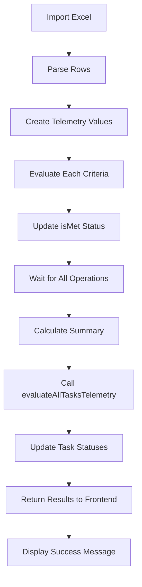

# Telemetry Import Fixes

## Issues Fixed

### 1. ❌ Import Progress Showing Zero
**Problem**: After importing telemetry data, the progress indicators (criteriaMet, attributesUpdated) were showing 0.

**Root Cause**: The `createTelemetryValueAndEvaluate` async function was being called without `await`, and errors were caught with `.catch()` but the promises were never collected. The code continued immediately without waiting for database operations to complete.

**Fix**: 
- Collected all import operations into a `Promise<void>[]` array
- Used `Promise.all(importOperations)` to wait for all operations to complete before calculating results
- Changed from `setTimeout(100)` workaround to proper async/await pattern

**Location**: `/data/dap/backend/src/services/telemetry/CustomerTelemetryImportService.ts` (lines 107-201)

**Before**:
```typescript
// Create telemetry value and evaluate criteria
this.createTelemetryValueAndEvaluate(
  attribute,
  parsedValue,
  batchId,
  recordDate,
  notes,
  taskResults.get(task.id)!
).catch((error: any) => {
  errors.push(`Row ${rowNumber}: Failed to create telemetry value - ${error.message}`);
});

// ... later
await new Promise(resolve => setTimeout(resolve, 100)); // Unreliable
```

**After**:
```typescript
const importOperations: Promise<void>[] = [];

// ... in loop
const operation = this.createTelemetryValueAndEvaluate(
  attribute,
  parsedValue,
  batchId,
  recordDate,
  notes,
  taskResults.get(task.id)!
).catch((error: any) => {
  errors.push(`Row ${rowNum}: Failed to create telemetry value - ${error.message}`);
});

importOperations.push(operation);

// ... after loop
await Promise.all(importOperations); // Wait for all to complete
```

---

### 2. ❌ String Not-Null Criteria Not Working
**Problem**: String values like "acmetest" were not being recognized as meeting the `string_not_null` criteria.

**Root Cause**: The evaluation function expected `value.value` to always be a string and called `.trim()` directly, which would throw an error if the value was another type or if the string conversion wasn't explicit.

**Fix**: 
- Added explicit type checking for null/undefined
- Added type conversion: `typeof stringValue === 'string' ? stringValue : String(stringValue)`
- Better error handling for edge cases

**Location**: `/data/dap/backend/src/services/telemetry/evaluationEngine.ts` (lines 250-279)

**Before**:
```typescript
private static evaluateStringNotNull(value: TelemetryValue): EvaluationResult {
  try {
    const stringValue = value.value;
    const success = stringValue !== null && stringValue !== undefined && stringValue.trim() !== '';
    
    return {
      success,
      details: success 
        ? `String value is not null/empty: "${stringValue}"`
        : 'String value is null or empty'
    };
  } catch (error) {
    return {
      success: false,
      error: `String not-null evaluation error: ${error instanceof Error ? error.message : 'Unknown error'}`
    };
  }
}
```

**After**:
```typescript
private static evaluateStringNotNull(value: TelemetryValue): EvaluationResult {
  try {
    const stringValue = value.value;
    
    // Handle different value types
    if (stringValue === null || stringValue === undefined) {
      return {
        success: false,
        details: 'String value is null or undefined'
      };
    }
    
    // Convert to string if needed
    const strVal = typeof stringValue === 'string' ? stringValue : String(stringValue);
    const success = strVal.trim() !== '';
    
    return {
      success,
      details: success 
        ? `String value is not null/empty: "${strVal}"`
        : 'String value is empty'
    };
  } catch (error) {
    return {
      success: false,
      error: `String not-null evaluation error: ${error instanceof Error ? error.message : 'Unknown error'}`
    };
  }
}
```

---

### 3. ℹ️ Task Status Import (By Design)
**Clarification**: Task status is NOT imported from the Excel file - this is working as designed.

**Expected Behavior**:
- The telemetry import file only contains attribute values
- Task status is automatically calculated based on telemetry criteria evaluation
- After import, `evaluateAllTasksTelemetry` is called automatically (see `customerAdoption.ts` line 1947)
- Status updates follow the rules in `TELEMETRY_STATUS_UPDATE_LOGIC.md`:
  - All required criteria met → DONE
  - Some criteria met → IN_PROGRESS
  - No criteria met → NOT_STARTED
  - Manual status takes precedence (except for NOT_STARTED)

**If task status needs to be manually set**: Use the Actions menu in the adoption plan UI.

---

## Additional Improvements

### 4. Better Criteria Total Calculation
**Improvement**: Changed `criteriaTotal` to only count attributes that have success criteria, not all attributes.

**Before**:
```typescript
criteriaTotal: task.telemetryAttributes.length,
```

**After**:
```typescript
criteriaTotal: task.telemetryAttributes.filter((a: any) => a.successCriteria).length,
```

**Why**: This gives more accurate completion percentages. Only attributes with criteria should be counted.

---

### 5. Enhanced Debug Logging
**Improvement**: Added console logging for criteria evaluation during import.

```typescript
console.log(`Evaluated ${attribute.name}:`, {
  value,
  criteria: attribute.successCriteria,
  isMet,
  details: evaluationResult.details
});
```

**Benefit**: Easier debugging when criteria evaluation isn't working as expected. Check backend logs to see evaluation details.

---

## Testing Checklist

After these fixes, verify:

- [ ] Import telemetry data from Excel
- [ ] Check that the success message shows correct counts:
  - ✅ Tasks Processed > 0
  - ✅ Attributes Updated > 0
  - ✅ Criteria Met count is accurate
  - ✅ Per-task completion percentages are correct
- [ ] Verify string_not_null criteria:
  - [ ] Empty string → criteria not met
  - [ ] Non-empty string (e.g., "acmetest") → criteria met
  - [ ] Null/undefined → criteria not met
- [ ] Verify task status updates automatically:
  - [ ] Check backend logs for evaluation output
  - [ ] UI shows updated task status
  - [ ] Task list reflects changes
- [ ] Verify manual status precedence:
  - [ ] Manually set task to DONE
  - [ ] Import telemetry with unmet criteria
  - [ ] Task remains DONE

---

## Related Files Modified

1. `/data/dap/backend/src/services/telemetry/CustomerTelemetryImportService.ts`
   - Fixed async/await pattern for import operations
   - Improved criteria total calculation
   - Added debug logging

2. `/data/dap/backend/src/services/telemetry/evaluationEngine.ts`
   - Fixed string_not_null evaluation with better type handling

3. `/data/dap/backend/src/schema/resolvers/customerAdoption.ts`
   - Already has `evaluateAllTasksTelemetry` call after import (line 1947)

---

## Backend Logs

To monitor telemetry evaluation during import:
```bash
tail -f /data/dap/backend.log | grep "Evaluated"
```

You should see output like:
```
Evaluated Environment Name: {
  value: 'acmetest',
  criteria: { type: 'string_not_null' },
  isMet: true,
  details: 'String value is not null/empty: "acmetest"'
}
```

---

## Status Update Flow



The key fix was ensuring step F (Wait for All Operations) actually waits before proceeding to G (Calculate Summary).
