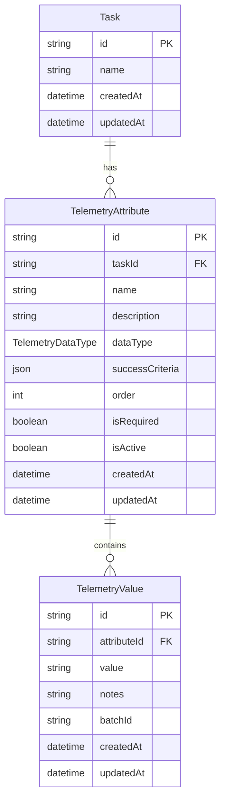

# Telemetry System Documentation

## Overview

The DAP Telemetry System provides a comprehensive framework for tracking task completion status through configurable telemetry attributes with complex success criteria evaluation. The system supports hierarchical data structures, AND/OR logic operations, and multiple data types.

## Architecture

### 🏗️ System Components

```
┌─────────────────────────────────────┐
│           Frontend UI               │
│  ┌─────────────────────────────────┐│
│  │    Task Dialog Components       ││
│  │  • Telemetry Configuration     ││
│  │  • Manual Value Entry          ││
│  │  • Progress Visualization      ││
│  └─────────────────────────────────┘│
└─────────────────────────────────────┘
                    │
                    ▼
┌─────────────────────────────────────┐
│           GraphQL API               │
│  ┌─────────────────────────────────┐│
│  │      Telemetry Resolvers        ││
│  │  • Query Operations             ││
│  │  • Mutation Operations          ││
│  │  • Type Resolvers               ││
│  └─────────────────────────────────┘│
└─────────────────────────────────────┘
                    │
                    ▼
┌─────────────────────────────────────┐
│        Service Layer                │
│  ┌─────────────────────────────────┐│
│  │      TelemetryService           ││
│  │  • CRUD Operations              ││
│  │  • Batch Processing             ││
│  │  • Completion Calculation       ││
│  └─────────────────────────────────┘│
└─────────────────────────────────────┘
                    │
                    ▼
┌─────────────────────────────────────┐
│        Evaluation Engine            │
│  ┌─────────────────────────────────┐│
│  │  TelemetryEvaluationEngine      ││
│  │  • Criteria Evaluation          ││
│  │  • AND/OR Logic Support         ││
│  │  • Multi-type Comparisons       ││
│  └─────────────────────────────────┘│
└─────────────────────────────────────┘
                    │
                    ▼
┌─────────────────────────────────────┐
│          Database Layer             │
│  ┌─────────────────────────────────┐│
│  │        Prisma Models            ││
│  │  • TelemetryAttribute           ││
│  │  • TelemetryValue               ││
│  │  • Audit Logging                ││
│  └─────────────────────────────────┘│
└─────────────────────────────────────┘
```

### 📊 Data Model



## Core Features

### ✅ Success Criteria Types

#### 1. Boolean Flag
Evaluates boolean values against expected outcomes.

```json
{
  "type": "boolean_flag",
  "expectedValue": true,
  "description": "Task is complete when deployment status is true"
}
```

#### 2. Number Threshold
Compares numeric values using various operators.

```json
{
  "type": "number_threshold", 
  "operator": "greater_than_or_equal",
  "threshold": 85,
  "description": "Performance score must be >= 85"
}
```

**Supported Operators:**
- `greater_than`
- `less_than`
- `equals`
- `greater_than_or_equal`
- `less_than_or_equal`

#### 3. String Match
Performs string comparisons with multiple matching modes.

```json
{
  "type": "string_match",
  "mode": "exact",
  "pattern": "PASSED",
  "caseSensitive": false,
  "description": "Code quality status must be PASSED"
}
```

**Supported Modes:**
- `exact` - Exact string match
- `contains` - String contains pattern
- `regex` - Regular expression match

#### 4. Timestamp Comparison
Evaluates dates and times with various comparison modes.

```json
{
  "type": "timestamp_comparison",
  "mode": "within_days",
  "referenceTime": "now",
  "withinDays": 7,
  "description": "Data must be updated within 7 days"
}
```

**Supported Modes:**
- `before` - Timestamp is before reference
- `after` - Timestamp is after reference  
- `within_days` - Timestamp is within N days of reference

#### 5. Composite AND Logic
All child criteria must evaluate to true.

```json
{
  "type": "composite_and",
  "description": "All conditions must pass",
  "criteria": [
    {
      "type": "boolean_flag",
      "expectedValue": true
    },
    {
      "type": "number_threshold",
      "operator": "greater_than",
      "threshold": 80
    }
  ]
}
```

#### 6. Composite OR Logic
At least one child criteria must evaluate to true.

```json
{
  "type": "composite_or",
  "description": "Any condition can pass",
  "criteria": [
    {
      "type": "string_match",
      "mode": "exact",
      "pattern": "PASSED"
    },
    {
      "type": "string_match", 
      "mode": "exact",
      "pattern": "APPROVED"
    }
  ]
}
```

### 📈 Data Types

The system supports four primary data types:

| Type | Description | Example Values |
|------|-------------|----------------|
| `BOOLEAN` | True/false values | `"true"`, `"false"`, `"1"`, `"0"` |
| `NUMBER` | Numeric values | `"85"`, `"92.5"`, `"-10"` |
| `STRING` | Text values | `"PASSED"`, `"In Progress"`, `"healthy"` |
| `TIMESTAMP` | Date/time values | `"2025-10-02T14:30:00Z"`, `"2025-10-01"` |

## API Reference

### 🔍 GraphQL Queries

#### Get Telemetry Attribute
```graphql
query GetTelemetryAttribute($id: ID!) {
  telemetryAttribute(id: $id) {
    id
    name
    description
    dataType
    successCriteria
    isRequired
    currentValue {
      value
      notes
      createdAt
    }
    isSuccessful
  }
}
```

#### Get Task Telemetry
```graphql
query GetTaskTelemetry($taskId: ID!) {
  telemetryAttributes(taskId: $taskId) {
    id
    name
    description
    dataType
    currentValue {
      value
      notes
    }
    isSuccessful
  }
  
  task(id: $taskId) {
    isCompleteBasedOnTelemetry
    telemetryCompletionPercentage
  }
}
```

### ✏️ GraphQL Mutations

#### Create Telemetry Attribute
```graphql
mutation CreateTelemetryAttribute($input: CreateTelemetryAttributeInput!) {
  createTelemetryAttribute(input: $input) {
    id
    name
    description
    dataType
    successCriteria
  }
}
```

#### Add Telemetry Value
```graphql
mutation AddTelemetryValue($input: AddTelemetryValueInput!) {
  addTelemetryValue(input: $input) {
    id
    value
    notes
    createdAt
    attribute {
      name
      isSuccessful
    }
  }
}
```

#### Batch Add Telemetry Values
```graphql
mutation AddBatchTelemetryValues($input: BatchTelemetryValuesInput!) {
  addBatchTelemetryValues(input: $input) {
    id
    value
    batchId
    attribute {
      name
    }
  }
}
```

## Usage Examples

### 🚀 Creating a Performance Monitoring Setup

```typescript
// 1. Create telemetry attributes for a task
const performanceAttribute = await createTelemetryAttribute({
  taskId: "task-123",
  name: "Response Time",
  description: "API response time in milliseconds",
  dataType: "NUMBER",
  successCriteria: JSON.stringify({
    type: "number_threshold",
    operator: "less_than",
    threshold: 200,
    description: "Response time must be under 200ms"
  }),
  isRequired: true,
  order: 1
});

// 2. Add telemetry values
await addTelemetryValue({
  attributeId: performanceAttribute.id,
  value: "150",
  notes: "Morning performance test"
});

// 3. Check completion status
const task = await getTask("task-123");
console.log(task.isCompleteBasedOnTelemetry); // true/false
console.log(task.telemetryCompletionPercentage); // 0-100
```

### 📊 Complex Health Check Example

```typescript
const healthCheckAttribute = await createTelemetryAttribute({
  taskId: "service-monitoring",
  name: "Service Health",
  dataType: "BOOLEAN",
  successCriteria: JSON.stringify({
    type: "composite_and",
    description: "All health conditions must pass",
    criteria: [
      {
        type: "boolean_flag",
        expectedValue: true
      },
      {
        type: "composite_or",
        criteria: [
          {
            type: "string_match",
            mode: "contains",
            pattern: "healthy",
            caseSensitive: false
          },
          {
            type: "string_match",
            mode: "exact", 
            pattern: "operational",
            caseSensitive: false
          }
        ]
      }
    ]
  })
});
```

### 🔄 Batch Processing Example

```typescript
// Process daily telemetry data
const batchId = `daily_${new Date().toISOString().split('T')[0]}`;

await addBatchTelemetryValues({
  batchId,
  values: [
    {
      attributeId: "attr1",
      value: "95",
      notes: "Daily performance score"
    },
    {
      attributeId: "attr2", 
      value: "true",
      notes: "Service availability check"
    },
    {
      attributeId: "attr3",
      value: new Date().toISOString(),
      notes: "Last health check timestamp"
    }
  ]
});
```

## Best Practices

### 🎯 Attribute Design

1. **Use Descriptive Names**: Make attribute names clear and specific
   ```typescript
   // Good
   name: "API Response Time (ms)"
   
   // Avoid
   name: "Performance"
   ```

2. **Set Appropriate Orders**: Use the `order` field to control display sequence
   ```typescript
   // Primary metrics first
   { name: "Deployment Status", order: 1 }
   { name: "Performance Score", order: 2 }
   { name: "Code Quality", order: 3 }
   ```

3. **Use Required Fields Wisely**: Mark critical metrics as required
   ```typescript
   isRequired: true  // For deployment status, critical performance metrics
   isRequired: false // For nice-to-have metrics, debugging info
   ```

### 📏 Success Criteria Guidelines

1. **Keep Criteria Simple**: Prefer simple criteria over complex composite ones when possible

2. **Document Thresholds**: Always include descriptions explaining why specific thresholds were chosen

3. **Use Appropriate Data Types**: Match criteria types with data types
   ```typescript
   // Correct
   dataType: "NUMBER"
   successCriteria: { type: "number_threshold", operator: "greater_than", threshold: 80 }
   
   // Incorrect  
   dataType: "STRING"
   successCriteria: { type: "number_threshold", operator: "greater_than", threshold: 80 }
   ```

### 🔄 Value Management

1. **Batch Related Updates**: Use batch operations for related telemetry updates

2. **Include Meaningful Notes**: Add context to telemetry values
   ```typescript
   {
     value: "85",
     notes: "Performance improved after optimization deployment"
   }
   ```

3. **Handle Failures Gracefully**: Always check for errors when adding values

## Error Handling

### Common Error Scenarios

1. **Invalid Success Criteria**: Malformed JSON in success criteria
2. **Type Mismatches**: Wrong data type for evaluation
3. **Missing Dependencies**: Referenced attributes or tasks don't exist
4. **Validation Failures**: Invalid enum values or required fields

### Error Response Example
```typescript
try {
  await createTelemetryAttribute(input);
} catch (error) {
  if (error.message.includes('Telemetry attribute')) {
    // Handle telemetry-specific errors
    console.error('Telemetry error:', error.message);
  }
  // Other error handling
}
```

## Testing

### 🧪 Sample Data

The system includes comprehensive sample data for testing:

- **5 telemetry attributes per task** with different data types
- **Various success criteria examples** (boolean, number, string, timestamp, composite)
- **Historical values** with realistic progression
- **Batch processing examples** with proper batch IDs

### 🔬 Testing Criteria Evaluation

```typescript
import { TelemetryEvaluationEngine } from '../services/telemetry';

// Test simple boolean criteria
const result = await TelemetryEvaluationEngine.evaluateAttribute({
  successCriteria: {
    type: 'boolean_flag',
    expectedValue: true
  },
  values: [{ value: 'true' }]
});

console.log(result.success); // true
console.log(result.details); // "Boolean value true matches expected true"
```

## Migration & Deployment

### Database Migration
The telemetry system includes a complete database migration:

```sql
-- Creates TelemetryAttribute and TelemetryValue tables
-- Adds proper indexes for performance
-- Sets up foreign key constraints
-- Includes cascade deletion rules
```

### Environment Variables
No additional environment variables required - the system uses existing database and authentication configuration.

### Backward Compatibility
The system is fully backward compatible:
- Existing tasks work without telemetry
- Old GraphQL queries continue to function
- New fields return appropriate defaults (empty arrays, false values)

## Version Information

- **Version**: 1.1.0
- **Last Updated**: October 7, 2025
- **Compatibility**: Node.js 18+, PostgreSQL 12+, Prisma 6+

## Support & Contributing

### File Structure
```
src/services/telemetry/
├── index.ts              # Main export point
├── types.ts              # TypeScript type definitions
├── evaluationEngine.ts   # Core evaluation logic
└── telemetryService.ts   # Business logic layer

src/schema/resolvers/telemetry/
├── index.ts              # Resolver exports
└── resolvers.ts          # GraphQL resolvers
```

### Adding New Criteria Types

1. Add new criteria type to `types.ts`
2. Implement evaluation logic in `evaluationEngine.ts`
3. Add tests for the new criteria type
4. Update documentation with examples

---

This documentation provides a comprehensive guide to the DAP Telemetry System. For additional support or feature requests, please refer to the project repository.